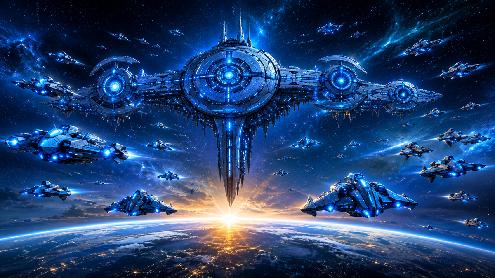

# Azul Baronis — One Ship Among Many

Azul Baronis is a deliberately asymmetric civilization for **Sid Meier's Civilization V: Brave New World** and **Community Patch 5.3.2+**. It discards the conventional military upgrade tree. Instead, named spacecraft remain in service for the whole game and refit themselves to exact statistics whenever Azul enters a new Era.

The working leader name is **The Player**. It is intentionally isolated behind `LEADER_AZUL_THE_PLAYER` and `TXT_KEY_LEADER_AZUL_THE_PLAYER`, making a later rename straightforward.

## Unique ability: One Ship Among Many

Exactly one Fighter or Destroyer is **★ Player Controlled**. That ship receives +1 Movement, +1 Sight, +25% Experience, and Afterburner—but no Combat Strength bonus. The designation can change only after the current vessel is destroyed or deliberately Self Destructs.

- Fighter Afterburner adds 2 Movement for the current turn.
- Destroyer Afterburner adds 1 Movement for the current turn.
- Afterburner consumes the ship's attack and has a persistent three-turn cooldown.
- If the Player Ship is lost, Fleet Systems highlights every surviving eligible vessel at the beginning of the next turn.

## Fleet

| Hull | First Era | Move | Range | Battlefield role |
| --- | --- | ---: | ---: | --- |
| Fighter | Ancient | 4 | 1 | Cheap dogfighter, reconnaissance, pursuit, city capture |
| Destroyer | Renaissance | 3 | 2/3 | Mobile heavy ranged platform with two exclusive weapons |
| Testudon | Industrial | 1 | 3 | Era-capped super-heavy siege and fleet anchor |

Every traversable land or Coast tile costs one Movement. The fleet never Embarks. Ocean becomes legal at Astronomy and Mountains at Flight. Fighters ignore enemy Zone of Control; Destroyers, Testudons, and Fleet Commanders obey it normally.

Fighters receive **Dogfighter** while they retain Movement: +25% defense against ranged attacks and a 10% chance to evade one completely. They may move after attacking.

Destroyers choose one weapon per turn:

- **Forward Beam:** the ordinary range-2 ranged strike with line of sight and normal defenses.
- **Homing Bomb:** range 3, 125% current Ranged Strength, indirect fire, terrain-defense compensation, and a persistent three-turn cooldown.

Testudons cannot attack after moving and cannot move after attacking. **Focused Beam** compensates for half of positive terrain and fortification modifiers while preserving the target's base strength. Their Super-Heavy Hull takes 25% less ranged damage, resists forced retreat, and cannot be captured or converted. Capacity is 1/2/3/4 in Industrial/Modern/Atomic/Information.

All three combat hulls remain genuine ranged units. When adjacent to a hostile city at its ranged-damage threshold, the Fleet Systems **Capture City** action invokes Civ V's conquest acquisition path, including resistance, occupation decisions, original-owner history, and diplomatic consequences.

## The Mothership

Azul's original Capital is permanently recorded as the true Mothership. Its Mothership Core is a full Palace replacement: it retains the Palace's +3 Production, +3 Science, +3 Gold, +1 Culture, and AI flavors, then adds +50 City HP, +15% City Ranged Strike Strength, +1 Sight, and two exclusive production processes.

**Charge Main Cannon** converts the Capital's production into a persistent Era-scaled battery. At full charge, **Fire Main Cannon** can instantly destroy a visible hostile combat unit within five tiles. Cities, civilians, Great People, and based aircraft are invalid targets. Firing empties the battery and consumes the Capital's city attack.

**Construct Defensive Turret** fills a second persistent meter. One completed turret may be stored and manually deployed on a confirmed legal tile within three tiles of the Mothership. Turrets are physical, stationary, destroyable, era-scaling ranged units, with a maximum of four.

If the original Mothership is captured, both meters reset, all deployed turrets are destroyed, and the emergency Capital receives an ordinary Palace. The civilization, fleet refits, and Player Ship system continue. Retaking the original city restores its Core with empty batteries.

## Fleet Commander and military restrictions

The **Fleet Commander** replaces the Great General without changing its aura, generation, stacking, or Citadel rules. It has 3 Movement and Azul traversal, but cannot fight or capture cities.

Azul may build ordinary civilian, trade, religious, archaeological, and economic Great Person units. Conventional military, recon, naval, air, nuclear, and modded combat-tree units are filtered out by default. The normal starting escort becomes an Ancient Fighter; the standard Settler remains.

## Era statistics

### Fighter

| Era | CS | RCS | Production |
| --- | ---: | ---: | ---: |
| Ancient | 6 | 7 | 50 |
| Classical | 8 | 11 | 70 |
| Medieval | 12 | 16 | 95 |
| Renaissance | 18 | 24 | 130 |
| Industrial | 26 | 34 | 180 |
| Modern | 38 | 50 | 250 |
| Atomic | 55 | 70 | 340 |
| Information | 75 | 95 | 450 |

### Destroyer

| Era | CS | RCS | Production |
| --- | ---: | ---: | ---: |
| Renaissance | 28 | 36 | 320 |
| Industrial | 40 | 52 | 420 |
| Modern | 58 | 74 | 560 |
| Atomic | 82 | 104 | 740 |
| Information | 110 | 138 | 960 |

### Testudon

| Era | CS | RCS | Production | Capacity |
| --- | ---: | ---: | ---: | ---: |
| Industrial | 65 | 85 | 800 | 1 |
| Modern | 90 | 118 | 1,050 | 2 |
| Atomic | 120 | 158 | 1,350 | 3 |
| Information | 155 | 205 | 1,700 | 4 |

## Installation

1. Install Brave New World and Community Patch 5.3.2 or newer.
2. Open `AzulBaronis.civ5proj` in ModBuddy and choose **Build Solution** (or use the checked-in `.modinfo` package source directly).
3. Confirm **Azul Baronis — One Ship Among Many (v 3)** appears in the Civ V `MODS` folder.
4. Enable Community Patch first, then Azul Baronis, and begin a new game.

The mod is single-player only because its custom target selectors and save-data state are not network synchronized for multiplayer.

## Repository map

- `SQL/00_Azul_Core.sql` — civilization, hulls, exact stats, Palace/processes, promotions, AI flavors.
- `SQL/10_Azul_Text.sql` — English UI, Civilopedia, diplomacy, and strategy text.
- `Lua/Azul_Gameplay.lua` — persistent mechanics, battle hooks, era replacement, AI, restrictions.
- `UI/Azul_FleetPanel.*` — dashboard, targeting, confirmation, highlighting, and actions.
- `Art/Icons` and `Art/Loading` — Civ V-compatible DDS civilization, leader, hull, ability, process, map, and Dawn of Man textures.
- `Art/README.md` — atlas index assignments and source-art manifest.
- `IMPLEMENTATION_NOTES.md` — technical design and engine integration details.
- `TESTING.md` — manual in-game regression matrix.
- `Tools/build_art.py` — deterministic PNG-to-DDS atlas builder for the supplied artwork.
- `Tools/validate_database.py` — database, art, project, and package validation against a Civ V debug DB.

The mod ships a complete custom 2D presentation: civilization and alpha symbols, The Player, every fleet hull, ability/process portraits, Mothership panels, and Dawn of Man. No new 3D meshes are shipped; the Fighter, Destroyer, Testudon, and turret reuse the Jet Fighter, Missile Cruiser, Battleship, and Mobile SAM art definitions respectively while remaining map-moving land-domain ranged units.
